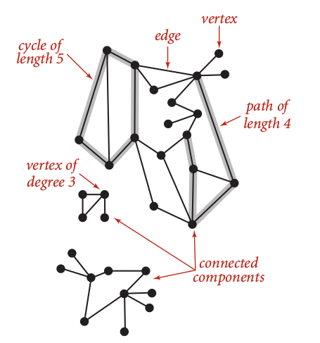
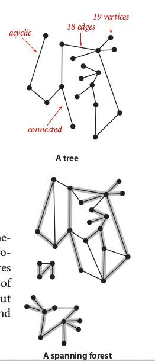
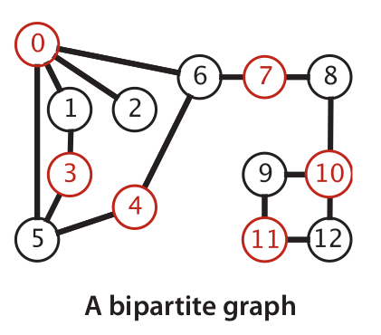
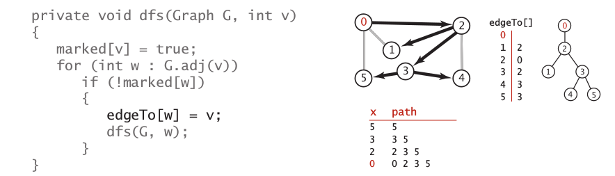

## 4.1 Undirected Graph {#4-1-undirected-graph}

Undirected graph is simplest model contains set of **vertices** and a collection of **edges** that each connect a pair of vertices. Each vertex has **degree** which contains how many adjacent vertices connected to it or also called as neighbors. A graph may has many **path**that sequence of verticesconnected by edges. A path called as simple path if has no repeated vertices.

|  |  |  |
| --- | --- | --- |

A graph my has **cycle** that a path has a same vertex at first at last. A cycle called as **simple cycle** if has no repeated edges or vertices between first an last. The length of a path and cycle defined by number of edges.

We called a graph is **connected** if every vertex connected. Furthermore, a set of connected graph called as set of **connected** **components**graph called as **acyclic** if has no cycles. If we can found an acyclic graph as subgraph of connected graph, then we called that as **tree**. A disjoint set of trees is called as **forest**. A single tree called as **spanning tree** if contains all vertices in the graph. A **spanning tree** is union of spanning trees of its connected components.

A graph called as**bipartite graph** if we can divide it into two set of graph.

### Depth-First Search {#depth-first-search}

DFS is oldest graph processing algorithm. Furthermore, we can say that DFS is representation of the nature of the recursion. Image below represent that the trace of recursive process can be drawn as a binary tree.

Each call will process current vertex at its first neighbor until we can not found a next first neighbor, then going up to explore next first neighbor of upper vertex. That is, we use stack to store each call step.

DFS can be used to solve **single source** **connectivity** problem and **single source path**.

### Breath-First Search {#breath-first-search}

BFS implementing Queue to store each call process, so we can iterate to all neighbor of current vertex first, then go to iterate all neighbors of next vertex. Intuitively, the method implemented by BFS is likely same as the way we try to learn best path at unknown places.

BFS can be sued to solve **single** **source shortest** **path.**