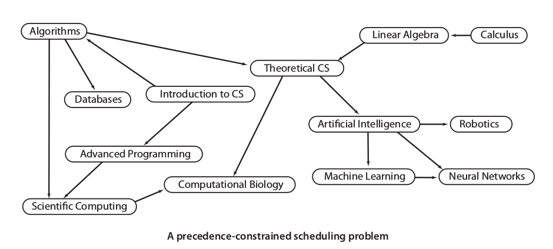
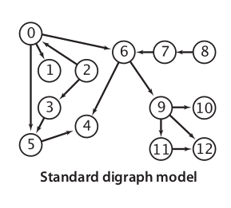
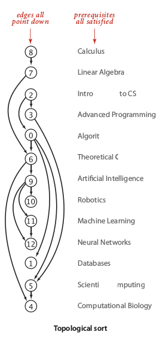

## 4.2 Directed Graph {#4-2-directed-graph}

A directed graph \(also called as digraph\) is set of vertices that each vertices may be connected with directed edge, so the connection may became ordered defined by arrow of edges.

Let **v → w** is one of vertex in digraph, then we say that **v is tail**or parent and **w is head ** or child. Remember, that a vertex v may has many childs. The **outdegree** is how many child that vertex v has, while **indegree** is how many child that vertex v has.

There are many application of digraph, some of them are **topological sort** for scheduling purpose using **Depth First Order algorithm**, finding **strong connected components ** for identify social network or electronic circuit using **kosajaru algorithm**. Another interesting application is **WordNet** which is rooted DAG \(Directed Acyclic Graph\) of words an its hypernims. We can determine semantic relationship between two words or more by implementing **Breath-First** to find **Shortest Ancestral Path** and **Ancestral Parent**.

### Scheduling Problem {#scheduling-problem}

Is one of most practical case of directed graph. For example, let a college schedule of computer science student shown below:

That’s a simple schedule that easy to remember and manage, but its will be a problem if we have huge number of entities in our schedule. To manage it better, we need mathematician thinking, simplify all of them into number. So, our schedule will looked like a picture at the right.

Let say, we need to pay attention into the study path that fit in our current study year. To do it better, we just need to implement topological order in our schedule graph. So, our study path will be looked like:

