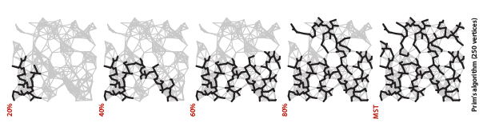
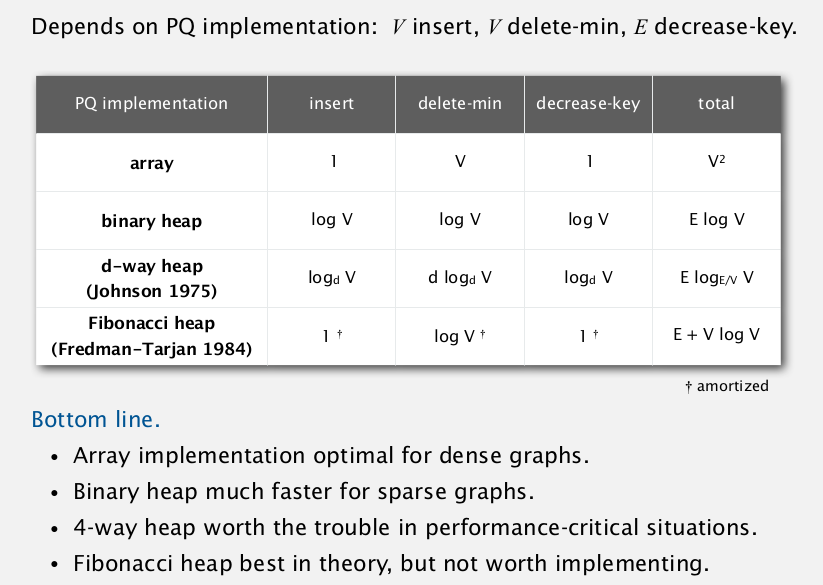
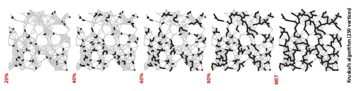
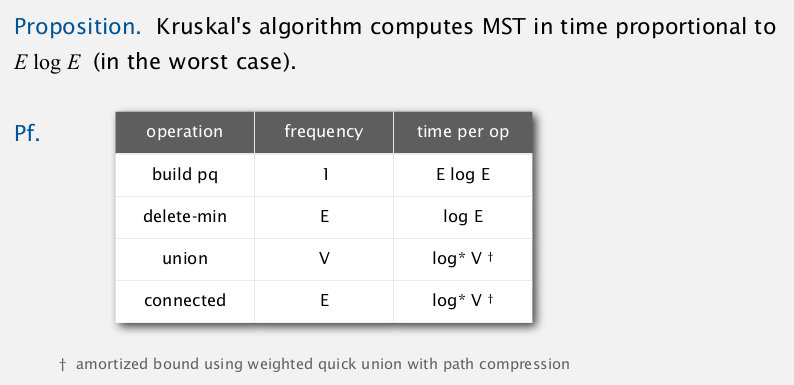

## 4.3 Minimum Spanning Tree {#4-3-minimum-spanning-tree}

Given an **edge-weighted graph**, **spanning tree** is a path that connected all vertex which is some of vertices could be grouped as acyclic subgraph. So then, **minimum spanning tree**(MST) is a spanning tree whose has lowest sum of weight of its edge.

There are two classical and most used algorithms to find minimum spanning tree:

### Prim’s algorithm {#prim-s-algorithm}

is an algorithm work like ‘growing tree’ to construct MST. This algorithm used Priority Queue to promoting next edge. Meanwhile, there are two approach that we can used to maintain priority queue; **Lazy approach** which still keeping ineligible edges in priority queue (space = E, time = E log E) and **Eager approach**which is keeping only eligible edges in priority queue (space = V, time = E log V).

We can do better in running time by implementing more sophisticated data structure.Keep in mind that its optimality case which should be consider. For example, we may used array rather that binary heap to solve minimum spanning tree ofdense graphs, so thinking about improving the running time will be useless. The detail running time of prim’s algorithm in different data structures described in table below:

### Kruskal algorithm {#kruskal-algorithm}

is an algorithm that work in ‘ordered manner’ to construct MST. This algorithm needed preprocessing that sorted list of edges, so then in processing we can easily choose best edge first until find longest possible edge (space = E, time = E log E).

Using priority queue and union finding, we could infer that the running time proportional to E log E:

