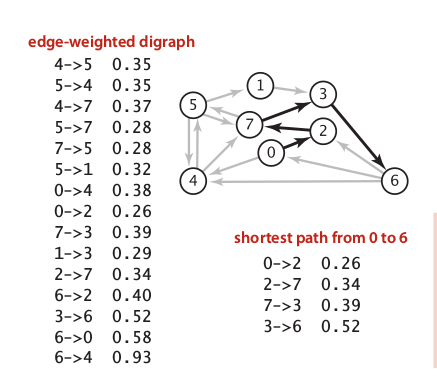
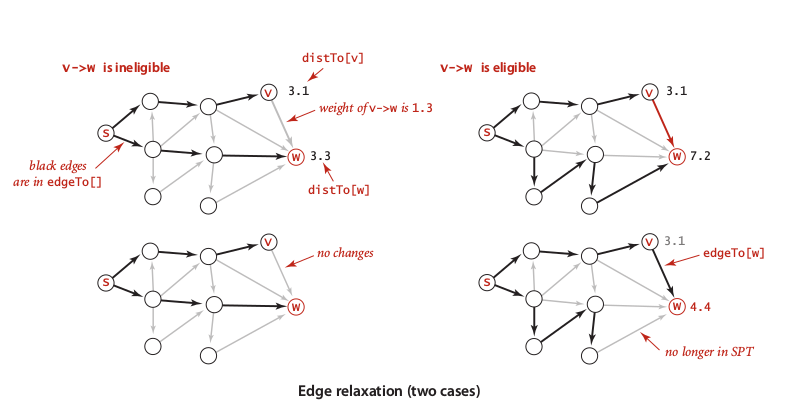
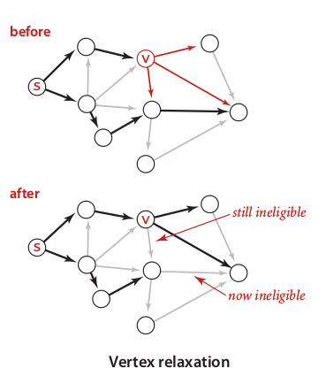
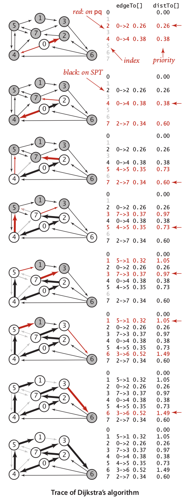
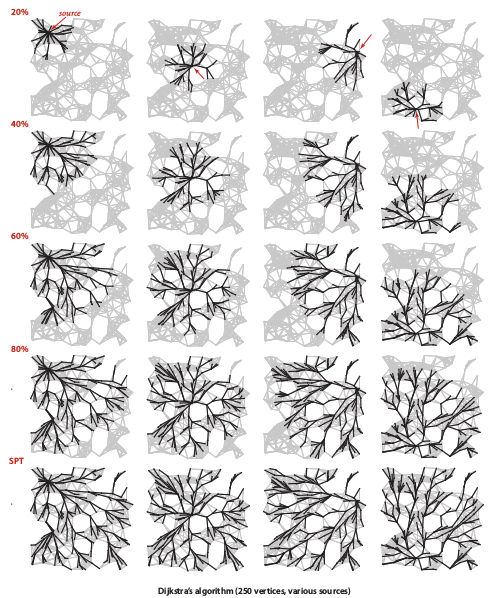
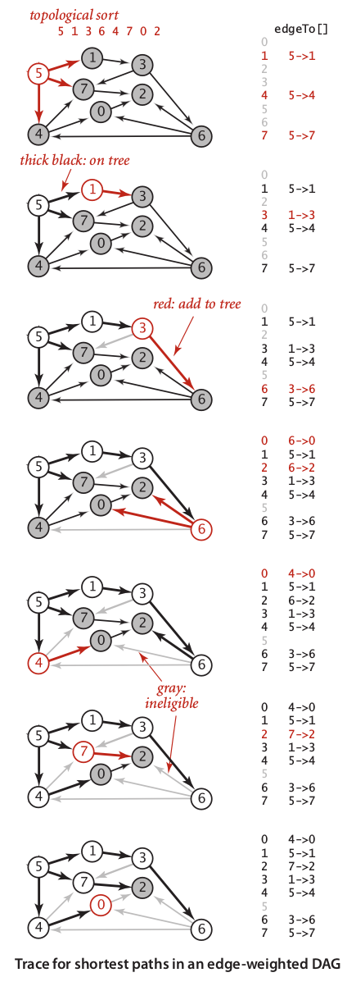
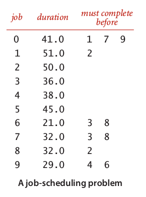
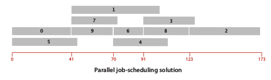
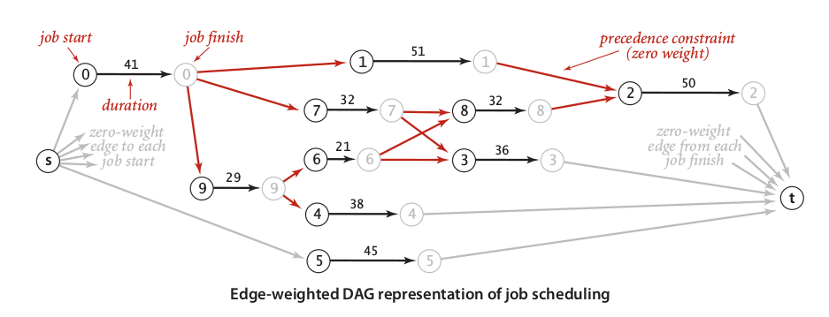
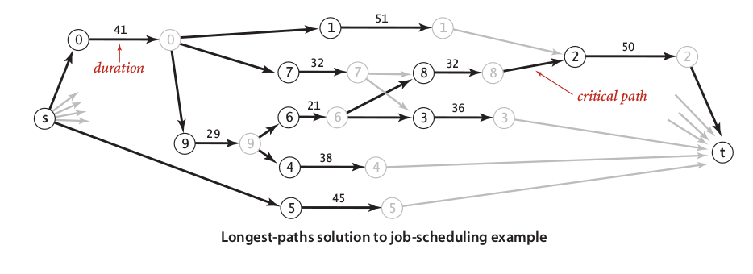

## 4.4 Shortest Paths {#4-4-shortest-paths}

Very practical application of graph algorithm. In the real world, it is obvious to find some constrains on the shortest part finding problem. For example, a path from A to B may reached in many different routes, to find the best one, we need to choose only the shortest which is defined by its distance should be lowest compared to any other alternative routes. We used **Edge-Weighted Digraph** as a model of routes which have contains and directions.

There are some operations that we used to implementing shortest path algorithms:

* Edge relaxation

  The main purpose of this operation is to find any shorter distance to a goal than we have already found. Let say, there are many alternative way to go from _s_ to _w_. There are set of _V’ = {v**1**, v**2**, v**3**, …, v**n**} \_that would connecting \_s_ to _w_. So in the end, the result of edge relaxation is find a _v\_i_ which is has shortest distance to _w_.

  

* Vertex relaxation

    
  This operation is similar to Euclidean distance in basic geometry. Let say, we need to find best _local path_ which is connected _v_ to _w_. Then, we just need to iterate all discoverable alternative route from _v_ to _w_. For all path that we have already collected, choose the one combination which is cheapest.

There are some algorithms that widely used to find shortest path in edge-weighted digraph:

* Dijkstra algorithm

  
This algorithm used breadth first method which is implementing heuristic function to choose every next edge that has optimal weight. In principle, Dijkstra algorithm work like prism algorithm, but in case used for digraph.  
The algorithm quite straightforward and easy to understand:

1. Implement BFS \(Breadth-First Search\) to do path finding.

2. Put an vertex _v_ if only if its distance to _w_ is shortest compared to best known best known distance already inserted into the tree.

3. Use priority queue to update indexed vertices.

Dijkstra algorithm uses space proportional to V and time proportional to E log V. The trace of Dijkstra algorithm look like growing tree which has equal balance in all discovered branches.

  
In the case of cycle in directed graph, there is a linear time algorithm which faster than Dijkstra algorithm to find shortest path in DAG \(Directed Acyclic Graph\). In the case of edge weight, Dijkstra algorithm worked well in the cyclic graph which has no negative weight within. We will used Bellman-Ford algorithm to deal with negative weight.

* Linear time weighted DAG shortest path

  
In short, this algorithm can be described below:

1. Do preprocessing to produce topological order using DFS \(Depth First Search\).

2. For every vertex in topological order, do vertex relaxation.

3. Add an edge to _w_, if only if its has not been visited.

4. If shorter distance from _s_ to _w_ found, add its vertex to the tree, but remove last addedvertex to _w_.

The running time of topological order is E + V, while running time of the relaxation of each V in topological order is exactly same:    E + V.

That is, so total running time is 2\(E + V\).

* Linear time weighted DAG longest path

  The solution of longest path finding in DAG is straightforward and super easy. All we need is just negate all weight in our DAG, so all weight changed into negative value.

* Parallel job scheduling

  Recall our scheduling problem in section 4.2 which is scheduling problem in single processor unit. In this problem, we have such a machine which has multi processor units that capable to process multiple jobs at same time. To do better with respect in processing time, we has to know how much time it should be all job to be done or the _upper bound_ of processing time.

  The best way to find the upper bound, we only need to implementing DAG longest path algorithm, so we will found a _critical path_ which is has to done at last order of parallel processing. Let take an example:

  Below we have a table of jobs with its intuitive solution:

    
  Look like so easy, but for me, it’s not. A critical path is longest path from start to end. To find it within fastest way, we need to implementing some rules in our longest path algorithm:

  1. Add two virtual vertices in the start and the end of our job schedule.

  2. A job indicated by two vertex units: an initial vertex \(_vi_\) and a terminal vertex \(_vj_\). There is a weighted edge connecting _vi_→_vj_ indicated as duration of job to be done.

  3. A constrain of two jobs _ji_ and _jt \_defined by a connection of_ vi ji_ _→vj_ jt_.

     So, referring from the rule above, the DAG representation of our parallel job scheduling has 2 \* N + 2 vertices.

     

     Our longest path algorithm will be found a critical path that looked like an image below:

     

* Parallel job scheduling with relative deadlines

  Our focus in this problem is to find whatever any deadlines is feasible or not. To do it, we only need to find the shortest paths. To represent constrain of relative deadlines, we need to create some rules:

  1. A deadline has negative weight and opposite direction.

  2. Constrain of deadlines create a cycle of two path: _P+_ which is contains a path from _v_ to _w _and P- which is contains a path from_ w_ to _v_.

  3. A feasible deadline as part of _P-_ should be making _P-_ has cost not less than _P+_.

  Unfortunately, there is no linear time algorithm existed to solve this problem. One algorithm will guarantee to provide optimal solution is Bellman-Ford algorithm which is exponential generaledge-weighted digraph algorithm.

* Bellman-Ford algorithm

  This algorithm is not perfect general for edge-weighted digraph, since we should avoid such negative cycle existed. If we consider the practical implementation, which one of them is parallel job scheduling with relative deadlines, then the negative cycle should be indicated an error in our schedule that should be fixed by supervised correction.

  Bellman-Ford algorithm quite simple that has E\*V running time and space proportional to V. This algorithm said, “For every vertex in digraph, do edge relaxation”. We can effort little improvisation of running time by maintain eligible vertex into queue.

